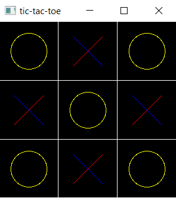
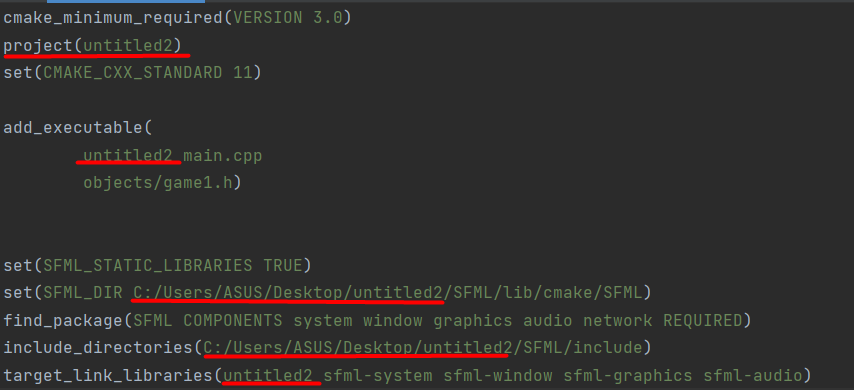

# Tic-Tac-Toe game made by OldBoldTurtle and Prichik
___

## Targets and goals
___
### The goal is to develop the skill of writing classes and functions in C ++, to discover new features of this programming language using the SFML library.
### Tasks - write a game of tic-tac-toe using the SFML library.

## An example of the game
___
### Detailed step-by-step lessons on how to create a tic-tac-toe game.
### https://www.youtube.com/playlist?list=PLRtjMdoYXLf4L0UVTggZdTV55baO6x6CO

## Description
___
### The usual implementation of the game tic-tac-toe in c ++ and SFML version 2.5.2
## How to play???
___
### First we need to install the SFML library
### After installation, run the file main.cpp and play in our game

## How to install SFML? (For windows users CLION)
___
### To do this, follow the link
### https://www.sfml-dev.org/download/sfml/2.5.1/
### Then you need slightly rework CMAKE
### We need to change the underlined lines to the name of the folder where our game is located and also change the path (change the underlined path to the file path where our game will be located)

## And now you can play
___

